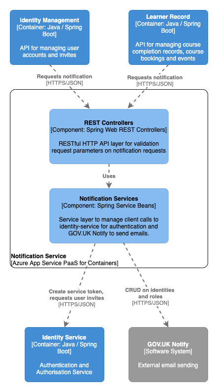

# Notification Service

## Purpose

Spring Boot based API acting as adapter service for GOV.UK Notify to send notifications to users such as account invites, account deletion and course completion. Other applications pass template references to Notification Service and it invokes the GOV.UK Notify API to send emails.

Note that this is not the only client of GOV.UK Notify in the LPG system. Currently two other services have direct integrations with GOV.UK Notify: Learner Record in its course reminder scheduled jobs and CSRS in its line manager allocation functionality.

## Component overview

See the `diagram/` folder for diagram source in draw.io XML format

## Dependencies

### Build-time

For a complete list of build dependencies check the `build.gradle` file. The main source dependencies are:  
- Spring Boot 2.0 (web, security)
- Spring Security OAuth2 2.3
- Azure App Insights 2.5
- GOV.UK Notify client 3.12

### Test-time

For a complete list of test dependencies check the `pom.xml` file. The main test dependencies are:  
- Spring Boot Starter Test
- Spring Boot Security Test
- mockito 2.8
- powermock 1.7

### Runtime 

#### Other LPG Services

- `identity-service` for OAuth token validation on all requests

#### External integrations

- GOV.UK Notify for sending email notifications to users

#### Data Stores

- none

#### Data migrations

- none

## Build, run, test, deploy

The application requires Java 8 (OpenJDK 8) installed to build and run.

Build the application using Gradle `./gradlew build`.

Run the project with `./gradlew bootRun` or import the project into your IDE of choice such as IntelliJ or VS Code use the IDE commands to Run Application.

Run the unit tests using `./gradlew test` or choose individual test classes or packages using your IDE.

The application is packaged as a docker container image and includes an Azure App Insights Java agent for collecting metrics from the app - see `Dockerfile` in the root directory for the container definition. `hammer` is the log collector used for aggregating log output.

The application also inclues a `Jenkinsfile` to define the Jenkins build pipeline stages and linking it to the docker image repository and correct terraform module.

Deployment is controlled via the Terraform scripts in the main PaaS repository, with per-environment configuration values referenced there and secrets injected from keybase.

## Configuration

Significant configuration properties are highlighted here. For the full configuration file see `src/main/resources/application.yml`

- `oauth` connection settings for the identity-service used to validate bearer tokens
- `govNotify` GOV.UK Notify API key

## Licenses

Notification Service is licensed by the MIT license, see `LICENSE` in the root folder for details. Dependent applications are licensed as according to their respective readme and license files.
